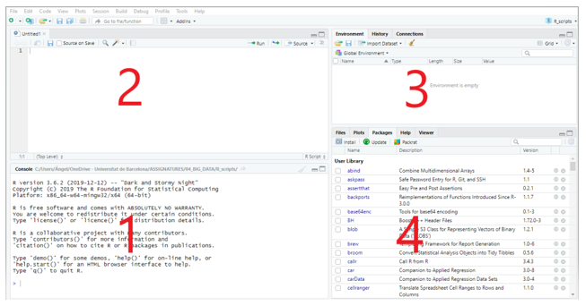

```{r setup, include=FALSE}
xaringanExtra::use_clipboard()
```

# Què és R i RStudio?

R és un entorn i llenguatge de programació enfocat a l'anàlisi estadística molt popular per l'anàlisi de dades massives. A partir de la seva versió fonamental (el que es coneix com a «R base»), qualsevol usuari pot publicar paquets que estenen aquesta configuració bàsica.

Començarem familiaritzant-nos amb l'entorn de treball R i l'*integrated development environment* (IDE) RStudio. Podem descarregar tots dos programes des de la següent adreça. És important fer la instal·lació en aquest ordre, primer R i després RStudio.

RStudio Desktop: <https://posit.co/download/rstudio-desktop/>

RStudio està dividit en quatre panells:

```{r echo=FALSE, out.width='100%', fig.align='center', fig.cap = "Interficie de RStudio"}

```

Consola (1): aquí és on R espera que li donem instruccions. Per a executar-les i obtenir el resultat premem «Intro». La primera vegada que obrim RStudio aquesta secció ocuparà tota la part esquerra de la pantalla.

*Scripts* (2): treballar en la consola és molt limitat ja que les instruccions s'han d'introduir una a una. És més habitual treballar amb *scripts* o fitxers d'instruccions que podem guardar i compartir. Per a veure aquesta secció en la pantalla cal obrir un *script* nou («File \> New File \> R Script»). Una altra opció una mica més avançáda és crear fitxers RMarkdown amb codi i narrativa.

Entorn, etc. (3) que inclou diverses pestanyes: *Environment* (on s'aniran registrant els objectes creats en la sessió de treball); *History* (es registren les instruccions executades); *Connections* i *Tutorial*.

Fitxers, etc. (4) que inclou les pestanyes: *Files*, *Plots*, *Packages*, *Help*, *Viewer* i *Presentation*. De moment, destacarem la pestanya *Packages*, que proporciona un llistat dels paquets disponibles en R i els que han estat carregats en la sessió. A través de les opcions d'aquesta pestanya podem instal·lar nous paquets o actualitzar els existents.

El més habitual serà treballar amb *scripts* en el panell 2 de la figura. Allí escriurem les funcions que volem executar. Així mateix, podem afegir comentaris que, per a diferenciar-los de les funcions, aniran precedits del signe `#` (per a convertir un text en comentari també és possible seleccionar-lo i prémer «Ctrl + Shift + C»). Encara que es poden executar diverses funcions d'una sola vegada, normalment executarem els *script* línia a línia. D'aquesta manera, si es produeix un error, sabrem immediatament en quina línia es troba. Per a executar una línia de codi, situem en ella el cursor i premem «Run» o «Ctrl + Intro».

Sovint utilitzarem «paquets» (*libraries*) que estenen la configuració bàsica de R. Per a utilitzar un paquet primer haurem d'instal·lar-lo (això ho farem una única vegada) i cridar-lo (això caldrà fer-ho cada vegada que obrim una sessió en R). És recomanable fer la crida al paquet a l'inici del *script*. Per exemple, aquests són els dos comandos per instal·lar i executar el paquet `tidyverse`:

```         
install.packages("tidyverse")
library(tidyverse)
```

A mesura que treballem amb R anirem acumulant fitxers (dades, *scripts*, resultats de les anàlisis, figures, etc.). Per a mantenir organitzada la informació, és recomanable treballar amb «projectes» (*projects*). Cada projecte té el seu propi directori, de manera que, en indicar un fitxer que volem utilitzar, no és necessari detallar la ruta per a accedir, sinó que R el buscarà en el directori del projecte. En el cas de projectes d'envergadura, és convenient crear subdirectoris de dades, *scripts* i *outputs*.

# Elements bàsics de R

En la seva versió més simple, és possible utilitzar R com una calculadora. Si introduïm en la consola 2+2, R ens retorna el resultat.

```{r}
2+2
```

En executar el codi, el resultat es mostra en la consola. No obstant això, moltes vegades serà útil guardar-ho en un objecte per a poder reutilitzar-lo. En R qualsevol cosa pot ser un objecte: una xifra, una paraula, una taula de dades, una figura, etc. Per tant, un objecte pot ser una cosa molt simple o una cosa molt complexa.

Per a crear un objecte, simplement li donem un nom i li assignem un valor usant l'operador `<-`

```{r}
objecte_1 <- 5
```

Acabem de crear un objecte anomenat `objecte_1` i li hem assignat el valor 5. És important evitar els espais en blanc en els noms d'objectes. Generalment se substitueixen per «\_» o per «.» Tampoc no podem iniciar el nom d'un objecte amb un dígit.

Ara creem un segon objecte:

```{r}
objecte_2 <- "bon dia"
```

En l'«Entorn» de RStudio podem veure els objectes creats, els seus valors i el tipus d'objecte que RStudio els ha assignat. Si assignem un nou valor a un objecte, R el substitueix sense avisar-nos pel que cal ser previngut per a evitar esborrar informació involuntàriament:

```{r}
objecte_2 <- 3
```

Ara tenim dos objectes del mateix tipus i podem combinar-los:

```{r}
objecte_3 <- objecte_1 + objecte_2
objecte_3
```

Un altre tipus d'objecte són els vectors. Crearem un vector concatenant vuit xifres:

```{r}
vector <- c(2, 3, 1, 6, 4, 3, 3, 7)
```

Podem calcular la mitjana del vector fent servir la funció `mean` i guardar-la en un altre objecte:

```{r}
mitjana_vector <- mean(vector)
mitjana_vector
```

Als exemples anteriors, hem vist objectes que contenien dos tipus de valors: numèrics (*numeric*) i caràcters (*character*). R considera dos tipus més d'informació: nombres sencers, sense decimals (*integers*) y lògics (*logical*) que adopten dos possibles valors: TRUE o FALSE.

Pel que fa a les estructures de dades, ja hem vist els vectors (*vectors*). A més, R inclou dades en matrius (*matrices* o *arrays*), llistes (*lists*) i *dataframes*. Aquest últim tipus d'estructura serà el que farem servir més sovint.

Un *dataframe* és un objecte bidimensional amb files i columnes. És similar a una matriu, amb la diferència que mentre la matriu només conté dades d'un tipus, els *dataframes* poden combinar diferents tipus de dades. Normalment, en un *dataframe* cada fila correspon a una observació individual i cada columna a una variable. En definitiva, un *dataframe* és similar a un full de càlcul en Microsoft Excel o en LibreOffice Calc.

A continuació es mostra un extracte del *dataframe* `iris` que està inclòs a la instal·lació base de R i que conté informació sobre diferents espècies de flors. Inclou dades numèriques (mesures de longitud i amplada de sèpals i pètals en centímetres) i categòriques (l'espècie):

```{r}
data(iris)
head(iris)

```

# Importació de datasets

Malgrat que és possible introduir dades directament en R (per exemple, creant vectors), el més habitual és importar-los des d'Excel o una altra font. Hi ha múltiples funcions per a fer-ho. Una forma senzilla és desar el fitxer Excel com un text separat per tabulacions i importar-lo des de RStudio amb la funció `read.table`.

En el següent exemple, s'ha importat des de R un fitxer anomenat «mostra.txt» amb tres paràmetres que indiquen que les dades tenen encapçalaments, les columnes estan separades per tabulacions i el símbol que utilitzem per a separar els decimals és la coma (R les convertirà en punts). Una vegada importats, les dades es guarden en un objecte anomenat «dades»:

```{r}
dades <- read.table(file = "data/mostra.txt",
                   header = TRUE,
                   sep = "\t",
                   dec = ",")

```

També podem importar arxius «.csv» amb la funció `read.csv` o importar fitxers des d'Excel amb l'opció «Import Dataset» de la pestanya «Environment». No obstant, verifiqueu sempre que les dades s'han important correctament, especialment si el fitxer Excel està formatat (inclou negretes, colors, etc.).

# Funcions bàsiques d'anàlisi

Ara podem treballar amb l'objecte «dades». Podem consultar l'estructura del *dataframe*:

```{r}
str(dades)

```

Per obtenir un resum estadístic de les dades:

```{r}
summary(dades)

```

Podem obtenir un estadístic d'una variable concreta (els noms de les variables s'indiquen amb el símbol «\$»), com ara la mitjana del pes:

```{r}
mean(dades$Pes)

```

Com ja hem vist, aquesta mitjana pot guardar-se en un altre objecte per a continuar treballant amb ella:

```{r}
mitjana_pes <- mean(dades$Pes)

```

Per fer un recompte de valors d'una variable:

```{r}
recompte_colors <- table(dades$Color)
recompte_colors

```

# Processament de dades

Molt sovint haurem de transformar, netejar i estructurar les dades per facilitar la seva anàlisi. Un dels paquets més utilitzats per a aquestes tasques és `dplyr`, que forma part de l’ecosistema `tidyverse`. Aquest paquet proporciona diverses funcions per manipular dades en format dataframe o tibble (una estructura de dades similar al dataframe).

```{r, message=FALSE, warning=FALSE}
library(tidyverse)

```

Per treballar amb `dplyr` és habitual fer servir *pipes*. Un *pipe* `%>%` és un operador que permet encadenar funcions. El *pipe* passa el resultat d'una expressió com a argument de la següent funció, evitant l'ús de parèntesis. A continuació, veurem l'ús de diverses funcions de `dplyr` fent servir *pipes*.

- `count()`: fa recomptes de casos

```{r}
dades %>% count(Genere)
```

- `filter()`: filtra files segons una condició

```{r}
dades %>% filter(Edat > 80)
```

- `select()`: selecciona columnes específiques

```{r}
noms <- dades %>% select(Nom)
head(noms)
```

- `mutate()`: crea o modifica columnes

```{r}
dades.2 <- dades %>% mutate(edat_doble = Edat * 2)
head(dades.2)
```

- `arrange()`: crea o modifica columnes

```{r}
dades %>% arrange(Pes)
```

Les variables qualitatives les ordena alfabèticament i les quantitatives en ordre ascendent. Si volem una ordenació descendent podem fer-ho amb `arrange(desc(Pes))`.

- `group_by()`: agrupa les dades segons els valors d'una o més variables

- `summarise()`: calcula estadístiques resum sobre un conjunt de dades

Aquestes dues últimes funcions són útils utilitzades conjuntament. Per exemple, agrupem els casos per gènere i calculem l'edat mitjana dins de cada grup.

```{r}
dades %>% group_by(Genere) %>% summarise(mean(Edat))

```

# Exercici per familiaritzar-se amb R i RStudio

A continuació, es proposa un exercici per començar a treballar amb R. No cal lliurar-lo.

1.  Instal·la R i RStudio en el teu ordinador.

2.  Inicia RStudio. Crea un nou projecte en un nou directori («File \> New Project» en el menú principal). Pots utilitzar aquest directori per a guardar les activitats del curs.

3.  Crea un *script* nou dins d'aquest projecte («File \> New File \> R Script») i guarda'l. Consulta la pestanya "Files" (panell inferior dret) per comprovar que s'ha guardat en el directori correcte.

4.  Explora els panells de RStudio per familiaritzar-te amb les diferents pestanyes.

5.  En l'editor de *scripts*, escriu help("mean") i executa l'ordre («Run»). Observa que el text d'ajuda s'obre en una pestanya del panell inferior dret. Examina les parts del text d'ajuda i els exemples del final.

6.  Crea una variable anomenada «primer_num» i assigna-li el valor 12 usant l'operador `<-`. A continuació, crea una altra variable anomenada «primer_text» i assigna-li el valor “aquest és el meu primer text”. Comprova en la pestanya *Environment* que s'han creat correctament.

7.  Assigna el valor "el meu segon text" a la variable «primer_text». Observa què ocorre en *Environment*. Per a mostrar el valor de les variables introdueix el seu nom en la consola.

8.  Importa el *dataset* de mostra que hem fet servir a l'explicació (està disponible al Campus Virtual).

9.  Instal·la i executa el paquet `tidyverse`. Fes un recompte de quantes persones tenen com a favorit cadascun dels colors en el *dataset*. A continuació, calcula la mitjana de pes dels homes i dones del *dataset*.

10. No oblidis guardar el teu *script*. Si vols, pots tancar el teu projecte seleccionant «File \> Close Project». No obstant això, no és obligatori que ho facis. Si no ho fas, la pròxima vegada que obris R Studio tornaràs a estar en aquest mateix projecte.
