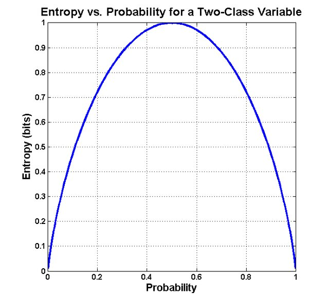
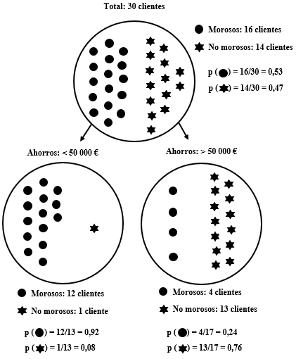
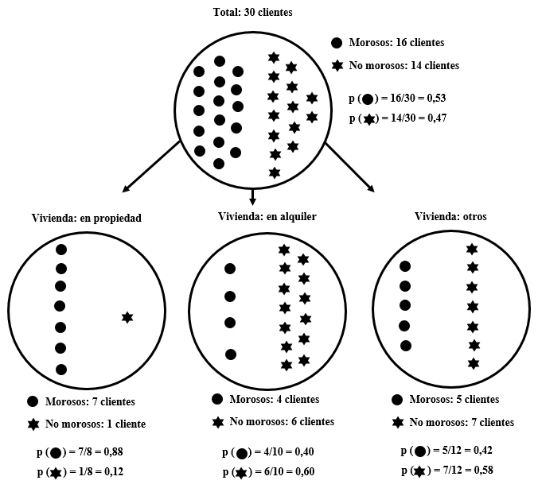

```{r setup, include=FALSE}
xaringanExtra::use_clipboard()
```

# Introducció
Un dels primers aspectes a considerar en l'anàlisi de grans quantitats de dades té a veure, justament, amb el gran volum d'informació disponible. Per a un conjunt d'individus podem tenir recopilades dades de multitud de variables i el primer problema al qual ens enfrontem consisteix a seleccionar aquelles variables més informatives: quins atributs són els millors per a segmentar la població?

Començarem amb un exemple extret de l'obra *Data Science for Business: What You Need to Know About Data Mining and Data-Analytic Thinking* de Foster Provost i Tom Fawcett. Un banc ha recopilat informació sobre els individus als quals ha concedit un préstec en el passat. A continuació, es disposa a estudiar aquesta informació per a conèixer quins atributs permeten predir si un subjecte retornarà —o no— un préstec. Per a simplificar-ho, pensarem que només tenim informació sobre dues variables: els «estalvis» (la quantitat de diners que la persona tenia en el banc en el moment de concessió del préstec; per a fer-ho senzill, dividirem la població en dos grups: els que tenien estalviats menys de 50 000 € i els que en tenien més) i la disponibilitat del «habitatge» (en aquest cas tindrem tres valors: en propietat, en lloguer o altres situacions).

El problema consisteix a determinar quina de les dues variables («estalvis» o «habitatge») és més informativa per a decidir si concedir o no un préstec a un nou client. La Taula 1 presenta les dades històriques d'una trentena de clients de l'entitat. Per exemple, el client 1, que va acabar sent morós, tenia menys de 50 000 € estalviats i l'habitatge en propietat en el moment de la concessió del préstec.


```{r, echo=FALSE}
morositat <- read.table(file = "data/morositat.txt",
                        header = TRUE,
                        sep = "\t",
                        dec = ",")
morositat
```

El primer pas consisteix a calcular l'entropia de cada grup d'individus. L'entropia fa referència al desordre, a la impuresa dins del grup. Com més impur o divers és un grup, més entropia conté. La fórmula és la següent:

$$entropia = – [p_1 × log_2 (p_1) + p_2 × log_2 (p_2) + … ]$$

Cada $p_i$ és la probabilitat (la freqüència relativa) de tenir l'atribut *i* i oscil·la entre 1 (quan tots els subjectes tenen l'atribut) i 0 (quan no el té cap). Els punts suspensius simplement indiquen que pot haver-hi més de dos atributs.

La Figura 1 mostra la corba de l'entropia en relació a les probabilitats d'un esdeveniment. Com s'observa, el seu valor és màxim (1) quan la probabilitat d'un esdeveniment binari és 0,5. Si tirem una moneda a l'aire, la probabilitat d'obtenir cara o creu és de 0,5. L'entropia és màxima i reflecteix la incertesa sobre el resultat.


```{r echo=FALSE, out.width='40%', fig.align='center', fig.cap = "Figura 1. Relació entre entropia i probabilitat. Font: Ekinoglu (2018)"}

```

En el cas de la morositat:

$p (morositat) = 16/30 = 0,53$

$p (no.morositat) = 14/30 = 0,47$

L'entropia seria la següent:

$entropia (morositat) = – [0,53 × –0,9 + 0,47 × –1,1] = 0,99$

L'entropia és molt elevada (0,99) ja que el grup és impur en el sentit que hi ha una elevada divisió entre morosos i no morosos. En el cas contrari, si tots els clients fossin morosos (o si cap ho fos), l'entropia tendiria a 0.

Nosaltres desitgem mesurar com d'informativa és una variable, és a dir, quanta informació ens proporciona sobre el valor de la variable que volem predir. El guany informatiu (*information gain*, *IG*) mesura en quina mesura un atribut redueix l'entropia en els segments que crea. Imaginem que la variable que utilitzem per a dividir el grup té *k* valors. En aquest cas, el grup inicial (progenitor) es dividirà en *k* subgrups. El valor informacional de l'atribut vindrà donat per l'increment en la puresa dels *k* subgrups respecte a la població inicial.

Seguint amb l'exemple, calculem l'entropia dels dos subgrups de clients creats en funció dels seus «estalvis» (Figura 2):

$entropia (< 50 000 €) = – [0,92 × –0,1 + 0,08 × –3,7]= 0,39$

$entropia (> 50 000 €) = – [0,24 × –2,1 + 0,76 × –0,4]= 0,79$

Amb aquestes dades ja podem calcular el guany informatiu (*IG*) d'acord amb la següent fórmula:

$IG = entropia (progenitor) – [p(c_1) × entropia (c_1) + p(c_2) × entropia (c_2) + … ]$

L'entropia de cadascun dels subgrups generats ($c_i$) es pondera multiplicant-la per la proporció de casos que pertanyen a aquest subgrup, $p(c_i)$. Seguint amb l'exemple anterior, calculem el guany informatiu resultat de dividir als clients en dos subgrups en funció dels seus «estalvis»:

$IG = 0,99 – [(0,43 × 0,39) + (0,57 × 0,79)] = 0,37$

Veiem que la divisió dels clients en dos subgrups, en funció dels seus estalvis, redueix substancialment l'entropia. En termes d'un model predictiu, podem dir que aquest atribut (els «estalvis») ofereix molta informació sobre el valor de la variable que desitgem predir (la «morositat»).

```{r echo=FALSE, out.width='50%', fig.align='center', fig.cap = "Figura 2. Dades de morositat de 30 clients d'un banc en funció dels seus estalvis"}

```

A continuació, analitzarem què ocorre si dividim el grup en funció de l'altra variable de la qual tenim dades, la disponibilitat de l'«habitatge». En aquest cas, la variable té tres valors: “en propietat”, “en lloguer” o “altres”.

$entropia (progenitor) = 0,99$

$entropia (propietat) = – [0,88 × –0,2 + 0,12 × –3,0] = 0,54$

$entropia (lloguer) = – [0,40 × –1,3 + 0,60 × –0,7] = 0,97$

$entropia (altres) = – [0,42 × –1,3 + 0,58 × –0,8] = 0,98$

$IG = 0,99 – [(0,27×0,54) + (0,33×0,97) + (0,40×0,98)] = 0,13$

La variable «habitatge» proporciona algun guany informatiu, però no tant com la variable «estalvis». Intuïtivament, en la Figura 3 podem observar que mentre que en el grup de clients que té l'habitatge “en propietat” (el de l'esquerra) s'ha reduït substancialment l'entropia, els altres dos grups (“en lloguer” i “altres”) no són molt més purs que el grup inicial.


```{r echo=FALSE, out.width='60%', fig.align='center', fig.cap = "Figura 3. Dades de morositat de 30 clients d'un banc en funció de la disponibilitat del seu habitatge"}

```

Per tant, a partir d'un *dataset* amb objectes descrits per atributs i una variable a predir, ja podem determinar quin atribut és el més informatiu per fer la predicció. Així mateix, podem ordenar els atributs pel seu valor informatiu. Això ens ajuda a entendre millor les dades i a reduir el volum de dades a analitzar, seleccionant aquells atributs que processarem.

# Càlcul del guany informatiu amb R
Per calcular l'entropia i el guany informatiu amb R utilitzarem el paquet `FSelectorRcpp`. Utilitzarem com a exemple el mateix *dataset* sobre morositat de la Taula 1.

El següent *script* conté tres ordres per a cridar a la llibreria (prèviament s'ha d'haver instal·lat amb la funció `install.packages`), importar el *dataset* (en un objecte que denominem «data») i visualitzar les primeres files:


```{r, message = FALSE, warning=FALSE}
library(FSelectorRcpp)
data <- read.table("data/morositat.txt", header=T, sep = "\t")
head(data)
```

Ara farem servir la funció `information_gain` per calcular la importància informativa que tenen els «Estalvis» a l'hora de calcular la «Morositat».

```{r}
FSelectorRcpp::information_gain(Morositat ~ Estalvis, data)
```

Podríem fer servir un codi similar per calcular la importància informativa que té l'«Habitatge». No obstant, amb el següent codi calculem la importància de les dues variables que hi ha al dataset (representades amb el punt) per calcular la seva importància de cara a calcular la «Morositat»:

```{r}
FSelectorRcpp::information_gain(Morositat ~ ., data)
```

Veiem que la variable més informativa són els «Estalvis» i, en menor mesura, l'«Habitatge». Les xifres que facilita `FSelectorRcpp` no coincideixen amb les que havíem obtingut anteriorment perquè, en lloc d'utilitzar el $log_2$, aquesta llibreria utilitza el logaritme natural (base *e*). En qualsevol cas, no canvia l'ordre de les variables ni la utilitat pràctica del guany informatiu, només l'escala numèrica.


# Exercicis

## Predir la classe d'un objecte
Crea el següent *dataset* en R. Recorda que pots copiar i enganxar les dades fent servir l'opció `Copy Code` a la part superior dreta del requadre.

```{r}
data <- data.frame(
  Classe  = c("A", "A", "B", "B", "B", "A", "B", "A", "B", "A"),
  Color  = c("Vermell", "Vermell", "Blau", "Blau", "Vermell", "Vermell", "Blau", "Vermell", "Vermell", "Blau"),
  Mida = c("Gran", "Petit", "Gran", "Petit", "Gran", "Gran", "Petit", "Gran", "Petit", "Gran"))

```

Utilitza el paquet `FSelectorRcpp` per determinar quina variable és més informativa per predir la classe d'un objecte. Com interpretes el resultat? Justifica la teva resposta.

## Predir el risc de patir diabetis
Un centre mèdic ha recollit informació sobre els hàbits alimentaris, exercici físic i qualitat de la són d'una trentena de pacients, així com si han desenvolupat o no diabetis (el *dataset* està disponible al Campus Virtual). Utilitza el paquet `FSelectorRcpp` per determinar quina variable és més informativa a l'hora de predir la probabilitat de què un nou pacient pateixi aquesta malaltia. Justifica la teva resposta.

## Sortirà aquest llibre en préstec?
Una biblioteca universitària analitza l'historial de préstec de 1000 llibres de la seva col·lecció. Imaginem que els 1000 llibres van ser adquirits simultàniament fa una dècada, de manera que han tingut el mateix temps per a sortir en préstec (el *dataset* està disponible al Campus Virtual).

Com a resultat de l'anàlisi, els llibres queden classificats en dues categories segons hagin tingut un volum de préstec “alt” (més de 250 préstecs en 10 anys) o “baix” (menys de 250 préstecs). Així mateix, s'analitzen tres variables amb la finalitat de determinar quina d'elles és més útil a l'hora de predir si una nova adquisició serà molt prestada i, per exemple, s'han d'adquirir exemplars addicionals. Aquestes tres variables són: la presència del llibre en la «bibliografia» recomanada d'alguna assignatura (“sí” o “no”); l'«editorial» que ho ha publicat (“comercial” o “universitària”); i l'«extensió» (“menys de 150 pàgines”, “entre 150 i 300 pàgines” o “més de 300 pàgines”).

Utilitza el paquet `FSelectorRcpp` per a determinar quina variable és més útil a l'hora de predir la sortida en préstec d'un llibre. Justifica la teva resposta.

## És verinós aquest bolet?
En la siguiente <a href="https://www.kaggle.com/datasets/uciml/mushroom-classification" target="_blank">pàgina web</a> està disponible un *dataset* amb informació sobre 8124 bolets. Cada bolet està representat en una fila amb dades en 23 columnes. La primera columna indica si el bolet és comestible (e, *edible*) o verinós (p, *poisonous*). Les 22 variables restants indiquen característiques com la forma, la textura, el color, l'olor, etc. Per exemple, la segona columna indica la forma del barret (*cap shape*) i pot adoptar sis valors (*bell=b*, *conical=c*, *convex=x*, *flat=f*, *knobbed=k*, *sunken=s*).

Igual que a les preguntes anteriors, l'objectiu és determinar quines són les tres característiques que aporten més informació sobre el caràcter comestible o verinós d'un bolet.

Per descarregar el *dataset* cal crear un compte (n'hi ha prou amb un de Google, per exemple), però per si algú no es vol autenticar, us he posat el fitxer al Campus Virtual.
