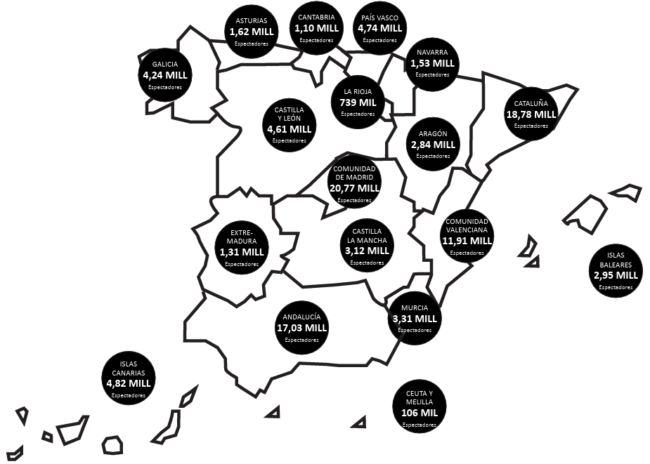

# Introducció
El paquet `ggplot2`, que vam veure en parlar de la creació de gràfics, en combinació amb `maps` permet fer mapes. Podem començar, simplement, dibuixant els països del món.

```{r, message=FALSE, warning=FALSE}
library(tidyverse)
library(maps)
ggplot() + borders("world")

```

Podem optar per representar només alguns països.

```{r}
ggplot() + borders("world", c("spain",
                              "portugal",
                              "france",
                              "italy",
                              "switzerland"))

```

# Situar punts en un mapa
He creat un petit *dataset* amb les coordenades geogràfiques d'una desena de ciutats. Si les necessiteu, podeu obtenir fàcilment les coordenades geogràfiques de qualsevol indret a través de Google Maps.

```{r}
ciutats <- read.table("data/ciutats.txt",
                      fileEncoding = "UTF-8",
                      header = TRUE,
                      sep = "\t")
head(ciutats)

```

Ara ubiquem aquestes ciutats al mapa.

```{r}
ggplot(ciutats) + borders("world", c("spain", "portugal")) +
  aes(x = lon, y = lat) +
  geom_point()

```

A continuació, reproduirem el mateix mapa, però posant els noms de les ciutats. Compareu el codi per determinar com influeix sobre la visualització.

```{r}
ggplot() + borders("world", fill = "white") +
  geom_point(data = ciutats, aes(x = lon, y = lat)) +
  geom_text(data = ciutats, aes(x = lon, y = lat, label = ciutat)) +
  coord_fixed (xlim= c(-10,10),
               ylim= c(35,45),
               ratio = 1.2)

```


# Mapa de comunitats autònomes
Farem ara un mapa de comunitats autònomes espanyoles. El paquet `mapSpain` proporciona els mapes d'Espanya amb divisions administratives, mentre que `sf` permet treballar amb dades espacials. El nom d'aquest paquet ve de *simple features*, un estàndard internacional per representar geometries (punts, línies, polígons). El paquet `scales` ens permetrà posteriorment millorar la presentació de les xifres.

```{r, message=FALSE, warning=FALSE}
library(mapSpain)
library(sf)
library(scales)

```

Obtenim, en primer lloc, les dades espacials de les comunitats autònomes.

```{r}
ccaa_map <- mapSpain::esp_get_ccaa()

```

A continuació, creem el mapa.

```{r}
ggplot(ccaa_map) +
  geom_sf(fill = "lightblue", color = "black")

```

Un mapa coroplètic o de coropletes és un mapa temàtic que utilitza un color per representar una variable quantitativa, que en aquest cas serà la població de cada comunitat autònoma.

El primer pas consisteix, doncs, a obtenir les dades de població de cada comunitat autònoma. En aquest cas, el fitxer amb les dades l'hem obtingut de l'INE: https://www.ine.es/jaxiT3/Datos.htm?t=2915.

Podríem carregar directament el fitxer i treballar-lo amb R, però segurament és més fàcil netejar el fitxer en Excel abans de carregar-lo. Observeu que forcem que el camp "Codigo" s'importi en format *character* i no com un número.

```{r}
poblacion <- read.csv("data/2915.csv",
                      fileEncoding = "latin1",
                      header = T,
                      sep = "\t",
                      colClasses = c(Codigo = "character"))
head(poblacion)

```

El següent pas consisteix a unir el mapa amb les dades de població pel codi numèric que identifica cada comunitat autònoma i que està present en tots dos *dataframes*.

```{r}
ccaa_map_pob <- ccaa_map %>%
  left_join(poblacion, by = c("codauto" = "Codigo"))

```

Ara ja podem crear el mapa.

```{r, warning=FALSE}
ggplot(ccaa_map_pob) +
  geom_sf(aes(fill = Poblacion), color = "white") +
  scale_fill_gradient(
    name = "Població",
    low = "#dceefb",
    high = "#0747a6",
    labels = label_comma(big.mark = ".")) +
  labs(title = "Població per Comunitats Autònomes",
    caption = "Font: Instituto Nacional de Estadística")

```

# Mapa dels Estats Units
El curs passat una companya vostra va voler fer un mapa dels Estats Units indicant algunes ciutats que havia visitat. Reprodueixo a continuació el procés que vam seguir.

En primer lloc, vam obtenir les dades geogràfiques. La funció `map_data` de `ggplot2` inclou alguns mapes preconfigurats, entre ells un dels estats d'Estats Units. El *dataframe* conté un llistat de punts que, units, configuren les fronteres dels estats.

```{r}
us_states <- map_data("state")
head(us_states)

```

Convertirem aquestes dades en un gràfic que guardarem en un objecte anomenat `mapa.USA` per millorar-lo progressivament.

```{r}
mapa.USA <- ggplot() +
  geom_polygon(data = us_states, aes(x = long, y = lat, group = group), color = "black", fill = "white")

mapa.USA

```

Etiquetarem cada estat amb el seu nom. Per fer-lo, en primer lloc obtindrem les coordenades del centre de cada estat. El següent codi suma la latitud i la longitud dels punts que representen cada estat i calcula la mitjana. Guardem aquesta informació en un objecte que anomenem `centre`.

```{r}
centre <- aggregate(cbind(long, lat) ~ region, data = us_states, FUN = mean)
head(centre)

```

Si posem el nom sencer de cada estat al mapa, ocuparan massa espai, de manera que anomenarem cada estat amb les seves inicials (les dues primeres lletres) que obtindrem dels noms que figuren al *dataset*. Amb el següent codi, extreiem les incials del camp "region" i les afegim a una nova columna. La funció `toupper` serveix per posar-les en majúscules.

```{r}
centre$inicials <- toupper(substr(centre$region, 1, 2))
head(centre)

```

Ara afegim aquestes inicials al mapa.

```{r}
mapa.USA <- mapa.USA +
  geom_text(data = centre, aes(x = long, y = lat, label = inicials), size = 3)

mapa.USA

```

El següent codi millora algunes qüestons estètiques. Afegim un títol i eliminem els títols dels eixos (la latitud i la longitud).

```{r}
mapa.USA <- mapa.USA +
  ggtitle("Ciutats dels EUA que recomano visitar") +
  theme(axis.line = element_blank(),
        axis.text = element_blank(),
        axis.title = element_blank(),
        axis.ticks = element_blank())

mapa.USA

```

Ara afegirem les ciutats. Podríem crear el dataset amb Excel o amb el bloc de notes i importar-lo. No obstant això, en aquest cas el crearem directament en R.

```{r}
US_cities <- data.frame(
  ciutat = c("Houston","Minneapolis", "Nova York", "San Francisco", "Seattle"),
  latitud = c(29.7558, 44.9424, 40.7128, 37.7631, 47.6062),
  longitud = c(-95.3802, -94.9147, -74.0060, -119.6559, -122.3321))

head(US_cities)

```


Només ens queda situar les ciutats al mapa. Ho farem amb punts de color verd.

```{r, warning=FALSE}
mapa.USA <- mapa.USA +
  geom_point(data = US_cities, aes(x = longitud, y = latitud, text = ciutat), color = "green", size = 3)

mapa.USA

```

Farem el mapa interactiu perquè, en passar el ratolí pels punts verds, apareguin els noms de les ciutats.

```{r}
mapa.USA.int <- plotly::ggplotly(mapa.USA, tooltip = "text")

mapa.USA.int

```


# Mapes con OpenStreetMap
Farem un mapa amb OpenStreetMap, una eina similar a Google Maps però amb llicència oberta. Necessitarem el paquet `leaflet`.

```{r}
library(leaflet)

```

Podem representar un o diversos punts al mapa indicant les seves coordenades.

```{r}
leaflet() %>%
  addTiles() %>% # afegeix les "teselas" que formen el mapa
  addMarkers(lng=2.1390, lat=41.3812, popup="Som a classe de Dades Massives a la FIMA!")

```


# Exercicis

## Ubicacions a un mapa
Elabora amb `ggplot2` un mapa amb uns 8 o 10 punts geogràfics. Els punts poden fer referència a qualsevol cosa que t'interessi (llocs que has visitat, restaurants recomanats, estadis de futbol, etc.). Intenta millorar l'estètica del mapa tant com sigui possible.

## Mapa de comunitats autònomes
Intenta replicar amb R el següent mapa amb les xifres d'assistència al cinema per comunitats autònomes l'any 2019. No cal fer servir la mateixa estètica, sinó que el mapa contingui la informació sobre l'assistència al cinema per comunitats autònomes.

Els 106.000 espectadors de Ceuta i Melilla els podeu repartir entre les dues ciutats (53.000 espectadors a cada ciutat, per exemple).

```{r echo=FALSE, out.width='80%', fig.align='center', fig.cap = "Font: https://bit.ly/3td73H4, p. 18"}


```


