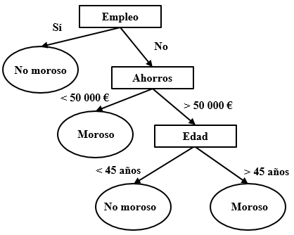
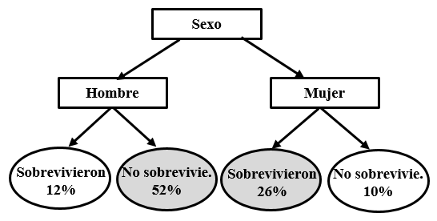

# Arbres de decisió
Un arbre de decisió és un tipus d'algoritme que consisteix en una sèrie de preguntes de resposta «sí» o «no» que porten a preguntes successives fins a prendre una decisió. Es basen en una estructura jeràrquica en forma d’arbre, on cada node representa una condició sobre una variable, cada branca correspon a un resultat possible d’aquesta condició i cada fulla indica una predicció o classe final. Aquests algoritmes són populars per la seva simplicitat i facilitat d’interpretació. Funcionen dividint el conjunt de dades en subconjunts més petits mitjançant regles basades en les variables d’entrada, buscant maximitzar la separació entre classes.

La següent figura mostra un exemple d'arbre. Partint de la part superior, l'arbre segmenta les dades de manera que cada costat correspon a un únic camí. Tornant a l'exemple de la morositat que vam fer servir al Tema 2, imaginem que volem classificar un subjecte de 40 anys, sense ocupació i amb uns estalvis de 115.000 €. Començant en la part superior, com que no té «ocupació», prenem el camí de la dreta. El següent node és el dels «estalvis». Com són superiors a 50 000 €, prenem de nou el camí de la dreta fins al node «edat». El valor és 40, de manera que anem a l'esquerra que ens indica que la predicció és que aquest subjecte no serà morós. Habitualment, més que saber la categoria en la queda classificat un subjecte, el que retornarà l'algoritme serà la probabilitat que acabi dins d'aquesta categoria. En aquest cas, les branques de l'arbre inclouran les probabilitats en comptes d'un valor simple.

```{r echo=FALSE, out.width='40%', fig.align='center', fig.cap = "Exemple d'arbre de decisió"}

```

Vegem un segon exemple. La nit del 14 al 15 d'abril de 1912, el «Titanic» es va enfonsar en xocar contra un iceberg en el seu viatge inaugural. Van sobreviure unes 700 persones d'entre les 2.200, entre passatgers i tripulació, que viatjaven en el vaixell. Diversos estudis han mostrat que les possibilitats de salvar-se depenien de diversos factors.

Podem intentar construir un algoritme que sigui capaç de predir si un determinat viatger se salvarà o no. Per a això comptem amb un fitxer amb les dades corresponents a 1309 passatgers disponible en https://www.kaggle.com/datasets/yasserh/titanic-dataset. Entre les variables predictores trobem la classe en la qual viatjava cada passatger («pclass» amb tres possibles valors: “primera”, “segona” o “tercera”), el tractament (“Mr”, “Mrs”, “Miss”, “Master”, etc.), el sexe («sex»), l'edat («age»), la tarifa («fare») o el port d'embarcament («embarked» que adopta tres valors: “Southampton”, “Cherbourg” o “Queenstown”), entre altres variables. La variable de resposta («survived») indica si cada passatger va sobreviure (“1”) o no (“0”).

L'exercici és purament teòric perquè el succés no es repetirà, però pot resultar un repte intel·lectual. El portal Kaggle.com inclou competicions en ciència de dades seguint sempre la mateixa dinàmica: s'ofereix als participants un conjunt de dades (*training set*) per a construir el seu algoritme i, a continuació, es mesura el rendiment amb un nou fitxer de dades (*test set*). 

Una manera molt senzilla d'enfrontar-se al problema seria predir que cap viatger va sobreviure. D'aquesta manera tan simple classifiquem correctament el 62% dels casos (el 62% dels passatgers van perdre la vida).

Podem complicar lleugerament l'arbre de classificació i afirmar que tots els homes van morir mentre que totes les dones van sobreviure. Amb aquesta afirmació el nostre algoritme ha millorat i el percentatge de casos classificats correctament s'ha elevat fins al 78% (els marcats en gris en la figura).

```{r echo=FALSE, out.width='40%', fig.align='center', fig.cap = "Exemple d'arbre de classificació"}

```

A partir d'aquesta formulació tan simple podem explorar si es produeixen millores com a resultat d'introduir regles més sofisticades (per exemple, una nova regla que determini que els homes que viatjaven en primera classe es van salvar mentre que la resta van morir).

# Creació d'un arbre de decisió amb R

## Exemple 1: morositat amb el paquet `party`
Per fer aquesta activitat recuperarem el *dataset* sobre morositat del Tema 2. Les dades estan en format *character*. Per construir l'algoritme, necessitem convertir-les a *factor*. Ho podem fer camp a camp.

```{r}
morositat <- read.table("data/morositat.txt", header = T, sep = "\t")
morositat$Estalvis <- as.factor(morositat$Estalvis)
morositat$Habitatge <- as.factor(morositat$Habitatge)
morositat$Morositat <- as.factor(morositat$Morositat)

```

També és possible fer la transformació per a tot el *dataframe* amb el paquet `dplyr` que forma part de `tidyverse`.

```{r, message=FALSE, warning=FALSE}
library(tidyverse)
morositat <- morositat %>%
  mutate_if(is.character, as.factor)

```

Ara crearem un arbre de decisió que ens permeti determinar la probabilitat que un nou client sigui o no morós. Per a això, utilitzarem el paquet `party`. Aquest paquet té una funció anomenada `ctree()` que serà la que usarem per crear l'arbre. La seva sintaxi bàsica és `ctree(formula, data)`. En `formula` indicarem la variable resposta i les variables predictores i en `data` les dades amb els quals alimentarem l'algoritme.

```{r, message=FALSE, warning=FALSE}
library(party)
arbre_morositat <- ctree(formula = Morositat ~ Estalvis + Habitatge, data = morositat)

```

A continuació, visualitzem l'arbre que resulta ser molt senzill. Recordem que els «estalvis» era la variable més informativa per determinar la probabilitat de morositat. De fet, segons l'arbre, un subjecte amb menys de 50.000 euros d'estalvis té una probabilitat superior al 90% d'esdevenir morós. Aquesta probabilitat està lleugerament per sobre del 20% entre els individus amb més de 50.000 euros.

```{r}
plot(arbre_morositat)

```

## Exemple 2: classificació de flors amb el paquet `rpart`
Per aquest exemple, utilitzarem un segon paquet anomenat `rpart`. També necessitarem carregar el paquet `rpart.plot` per representar l'arbre.`

```{r}
library(rpart)
library(rpart.plot)

```

Hi ha diferències en els tests estadístics que utilitzen `party` i `rpart` per crear els arbres i l'un o l'altre poden ser més o menys adient segons les variables estiguin més o menys equilibrades o amb diferents escales.

Per aquest exemple, farem servir el paquet `iris` que conté mesures de tres espècies diferents de flors Iris: "setosa", "versicolor" i "virginica".

```{r}
data(iris)
head(iris)

```

Creem l'arbre de decisió per predir la variable 'Species':

```{r}
arbre_flors <- rpart(Species ~ ., iris)

```

I el representem.

```{r}
rpart.plot(arbre_flors)

```


## Exemple 3: classificació de parlants natius amb el paquet `party`
Una escola d'anglès ha fet una prova de nivell a 200 nens d'entre 5 i 11 anys. Per a cadascun tenim l'edat i el resultat d'una prova d'escriptura i una altra de lectura. Així mateix, sabem si els nens són parlants natius d'anglès o no. A continuació es presenta un extracte amb els 10 primers casos.

```{r}
natius <- read.table("data/natius.txt", header = T, sep = "\t")
natius$Natiu <- as.factor(natius$Natiu)
head(natius, 10)

```

A partir de les dades d'edat i del resultat de les proves de lectura i escriptura, crearem un arbre de decisió que ens permeti determinar si un nen és parlant natiu d'anglès o no.

En comptes de treballar amb totes les dades, seleccionarem les primeres 105 entrades que emmagatzemem en l'objecte `natius_1`.

```{r}
natius_1 <- natius[c(1:105), ]

```

Creem l'arbre utilitzant la funció `ctree`. Indiquem que la variable que volem predir és la probabilitat que un nen sigui natiu basant-nos en tres variables predictores: edat, lectura i escriptura. Emmagatzemem el resultat en un objecte denominat `arbre` i el representem.

```{r}
arbre_natiu <- ctree(formula = Natiu ~ Edat + Lectura + Escriptura,
               data = natius_1)
plot(arbre_natiu)

```

Provem ara a repetir el procés amb les dades dels 200 nens. En tenir més informació, l'arbre es torna més complex. Si no el veieu completament, podeu reproduir el codi en RStudio.

```{r}
arbre_natiu2 <- ctree(Natiu ~ Edat + Lectura + Escriptura,
                natius)
plot(arbre_natiu2)

```

Utilitzarem aquest últim arbre per fer una predicció sobre un nou cas. Es tracta d'un nen de 5 anys amb un resultat de 50 tant a la prova de lectura com a la d'escriptura. 

```{r}
cas.1 <- data.frame(
  Edat = as.integer(5),
  Lectura = as.integer(50),
  Escriptura = as.integer(50))

predict(arbre_natiu2, newdata = cas.1, type = "response")

```

L'algoritme classifica el cas com a parlant natiu. Per consultar la probabilitat, modifiquem el paràmetre "type".

```{r}
predict(arbre_natiu2, newdata = cas.1, type = "prob")

```

Acabarem amb la classificació d'un nou cas, corresponent a un nen de 10 anys amb un resultat de 43 tant a la prova de lectura com a la d'escriptura. 

```{r}

cas.2 <- data.frame(
  Edat = as.integer(10),
  Lectura = as.integer(45),
  Escriptura = as.integer(45))

predict(arbre_natiu2, newdata = cas.2, type = "response")
predict(arbre_natiu2, newdata = cas.2, type = "prob")

```

# Exercici: portar ulleres o lentilles?
Una òptica ha recopilat la següent informació sobre una mostra de clients: edat, patologia, astigmatisme i lacrimosidad. A partir d'aquestes dades, s'indica si la persona ha de portar lents de contacte (toves o rígides) o si és convenient que usi lents de contacte. L'objectiu de l'activitat és elaborar un arbre de decisió per determinar la prescripció adequada per a un jove amb miopia i astigmatisme i lacrimosidad reduïda.

```{r}
lents <- read.table("data/lents.txt", header = T, sep = "\t")
lents

```


