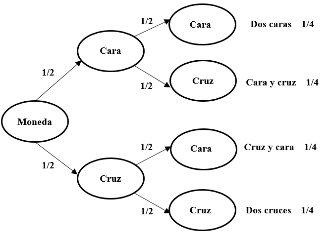
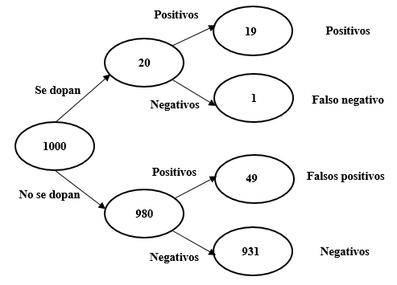

# Introducció
Com hem vist en temes anteriors, molts algoritmes de ciència de dades es basen en la idea d'«entrenar» un model perquè, a continuació, faci prediccions usant els exemples que ja han estat classificats. Alguns d'aquests models es basen en l'estadística bayesiana, un tipus d'inferència estadística en la qual les evidències o observacions s'empren per a actualitzar o inferir la probabilitat que una hipòtesi sigui certa.

Comencem amb un exemple relatiu a dos successos independents. Si tiro una moneda a l'aire dues vegades consecutives, quina és la probabilitat d'obtenir dues cares? Atès que el resultat del primer llançament (A) no influeix sobre el resultat del segon (B):

$$p (AB) = p (A) × p (B) = 1/2 × 1/2 = 1/4$$

```{r echo=FALSE, out.width='40%', fig.align='center', fig.cap = "Figura 1. Possibles resultats de llançar dues monedes"}

```

La probabilitat conjunta de dos successos independents (A i B) és la probabilitat que es doni A multiplicada per la probabilitat que ocorri B donat A i es representa amb la següent fórmula:

$$p (AB) = p (A) × p (B | A)$$

En el cas del llançament de la moneda, la probabilitat que surtin dues cares és igual a la probabilitat que surti cara [p (A) = 0,5], multiplicada per la probabilitat que torni a sortir cara si en el primer llançament ha sortit una cara [p (B | A) = 0,5]. Per tant, 0,5 × 0,5 = 0,25.

Atès que A i B són successos independents, seguint la mateixa lògica podem afirmar que la probabilitat conjunta (A i B) és la probabilitat que es doni B multiplicada per la probabilitat que ocorri A donat B:

$$p (AB) = p (B) × p (A | B)$$

Per tant:

$$p (A) × p (B | A) = p (AB) = p (B) × p (A | B)$$

De l'anterior, es deriva el teorema de Bayes:

$$p (A | B) = \frac{p (B | A) × p (A)} {p (B)}$$


## Exemple 1: tabaquisme i càncer
Suposem que la probabilitat de patir càncer és de 0,05. És a dir, el 5% de la població pateix càncer $p (A) = 0,05$. Ara suposem que la probabilitat de ser fumador és de 0,10. És a dir, el 10% de la població fuma $p (B) = 0,10$. Sabem que el 40% dels pacients amb càncer són fumadors, de manera que $p (fumador | càncer) = 0,40$. O, cosa que és el mateix, $p (B | A) = 0,40$. Quina és la probabilitat de patir càncer si s'és fumador? Aplicant el teorema de Bayes:

$$p(\text{càncer|fumador}) = \frac{p (\text{fumador│càncer}) × p (\text{càncer})} {p (\text{fumador})} = \frac {0,40 × 0,05} {0,10} = 0,20$$

És a dir, com que la ràtio de tabaquisme és el quadruple entre les persones que pateixen càncer que en el conjunt de la població, es quadriplica la probabilitat de patir càncer entre les persones que fumen.

## Exemple 2: dopatge d'atletes
Imaginem un test de dopatge amb una fiabilitat del 95%. És a dir, el test classifica correctament al 95% dels atletes que es dopen i al 95% dels que no. Sabem, per estudis previs, que 2 de cada 100 atletes (el 2%) recorre al dopatge.

Els resultats d'aplicar el test a 1000 atletes es mostren en la Figura 2.

```{r echo=FALSE, out.width='40%', fig.align='center', fig.cap = "Figura 2. Resultats d'aplicar a 1000 atletes el test de dopatge"}

```

El test ens oferirà 19+49 = 68 positius. No obstant això, només 19 corresponen realment a atletes que es dopen (19/68 = 28%). El 72% restant són falsos positius. Malgrat el 95% de fiabilitat del test, la majoria de positius són falsos.

És important no confondre la probabilitat que un test doni un resultat positiu donat l'atleta es dopa $p (B | A) = 95\%$ amb la probabilitat que un atleta es dopi donat un test positiu $p (A | B) = 28\%$. Vegem el mateix resultat aplicant el teorema de Bayes:

$$p (A | B)= \frac{p (B | A) × p (A)} {p (B)}$$

$$p(\text{dopatge|positiu}) = \frac{p (\text{positiu│dopatge}) × p(\text{dopatge})} {p (\text{positiu})} = \frac{0,95 × 0,02} {0,068}  = 0,28$$

## Exemple 3: filtres de *spam*
El teorema de Bayes té múltiples aplicacions en ciència de dades. Una d'aquestes utilitats és la construcció de detectors de correu brossa (*spam*). El sistema consisteix a analitzar les característiques dels correus *spam*: qui és l'emissor, nombre de destinataris, existència d'arxius adjunts, errors ortogràfics, paraules que apareixen en el missatge, etc.

Ens centrarem ara en l'aparició de paraules, per exemple, els termes «barat» i «comprar». En una mostra de 100 missatges, observem que 25 són *spam* i 75 no ho són. Dels 25 missatges que sí que són *spam*, la paraula «barat» apareix en 20 d'ells. Entre els 75 que no són *spam*, la paraula «barat» apareix en 5 d'ells:

$$p (\text{barat | spam}) = 20/25 = 0,80$$

$$p (\text{barat | no spam}) = 5/75 = 0,066$$

En el cas de la palabra «comprar», la seva probabilitat d'aparició en un missatge d'*spam* és 15/25 i en un missatge que no sigui *spam* de 10/75.

$$p (\text{comprar | spam}) = 15/25 = 0,60$$

$$p (\text{comprar | no spam}) = 10/75 = 0,133$$

Si suposem que l'aparició de les dues paraules són successos independents, la probabilitat que apareguin conjuntament serà el producte de les probabilitats individuals. Així, en el cas dels missatges de *spam*, la probabilitat que apareguin juntes totes dues paraules és la següent:

$$p (\text{barat i comprar | spam}) = 0,8 × 0,6 = 0,48$$

La probabilitat és de 0,48, és a dir, que 12 de cada 25 missatges d'*spam* contindran les paraules «barat» i «comprar» simultàniament.

Seguint el mateix procediment, podem calcular la freqüència conjunta de totes dues paraules en missatges que no siguin *spam*. Veiem que la probabilitat és molt inferior, no arriba ni a un correu electrònic dels 75:

$$p (\text{barat i comprar | no spam}) = 0,066 × 0,133 = 0,009$$

Aplicant el teorema de Bayes ja podem calcular la probabilitat que un missatge sigui *spam* —o no ho sigui— segons l'aparició de la paraula «barat», «comprar» o ambdues.

$$p (\text{spam | barat}) = \frac{p (\text{barat │ spam}) × p(\text{spam})} {p (\text{barat})} =  \frac{0,8 × 0,25} {0,25} = 0,80$$

$$p(\text{spam | comprar}) = \frac{p (\text{comprar │ spam}) × p(\text{spam})} {p (\text{comprar})} = \frac{0,6 × 0,25} {0,25}  = 0,60$$

Finalment, podem calcular la probabilitat de què apareguin les dues paraules conjuntament:

$$p(\text{spam│barat i comprar})$$

$$= \frac{p (\text{barat | spam)} × p (comprar | spam) × p (spam)} {p(barat│spam) × p(comprar|spam) × p(spam) + p(barat|no spam) × p(comprar|no spam) × p(no spam)}$$

$$= \frac{(0,8 × 0,6 × 0,25)} {(0,8 × 0,6 × 0,25)+(0,066 ×0,133 ×0,75)} = 0,94$$

És a dir, segons el nostre algorisme, si un missatge conté les paraules «barat» i «comprar» hi ha un 94% de possibilitats que sigui *spam* (i 6% que no ho sigui).

Podem ampliar la llista de paraules incloent, per exemple, la paraula «treball». Òbviament, a mesura que afegim paraules, les probabilitats que apareguin totes juntes es van reduint, però és possible calcular la probabilitat que apareguin multiplicant les probabilitats de les paraules individuals. Suposem que la paraula «treball» apareix en 5 dels missatges que són *spam* i en 30 dels missatges que no són *spam* de la mostra).

$$p (\text{treball | spam}) = 5/25 = 0,2$$

$$p (\text{treball | no spam}) = 30/75 = 0,4$$

Per tant,

$$p (\text{spam │ barat i comprar i treball}) = $$

$$= \frac{0,8 × 0,6 × 0,2 × 0,25} {(0,8 × 0,6 × 0,2 × 0,25) + (0,066 × 0,133 × 0,4 × 0,75)} = 0,90$$

En aquest cas, segons el nostre algorisme, si un missatge conté simultàniament les paraules «barat», «comprar» i «treball» hi ha un 90% de possibilitats que sigui *spam* —i un 10% de probabilitats que no ho sigui—. La raó de la reducció del percentatge respecte al cas anterior és que «treball» és una paraula associada a missatges que no són d'*spam*.


# Implementació d'un classificador bayesià en R
En primer lloc, cal instal·lar i cridar el paquet `e1071` que utilizarem per aquesta activitat.

```{r, message=FALSE, warning=FALSE}
library(e1071)

```

Una escola d'aviació ha recopilat les dades del temps de 14 dies i la indicació de si en cadascun d'ells es va poder volar o no. La següent taula presenta els resultats. Amb aquesta informació vol ser capaç de predir, a partir de la previsió meteorològica, si serà possible fer pràctiques de vol o no en un dia determinat.

```{r, echo=FALSE}
vols <- read.table("data/vols.txt", header=T, sep = "\t")
print(vols)

```


Importem el fitxer de dades amb la informació sobre el temps i les condicions de vol.

```{r, message=FALSE, warning=FALSE}
vols <- read.table("data/vols.txt", header=T, sep = "\t")

```

El següent pas consisteix a construir el model predictiu utilitzant la funció `naiveBayes`. Com a arguments, indiquem la variable que desitgem predir i l'origen de les dades.

```{r}
VolarModel <- e1071::naiveBayes(Volar ~ ., vols)

```

Vegem les característiques del model.

```{r}
print(VolarModel)
```

Si ens fixem, simplement ha calculat la probabilitat global de volar (es va poder volar en 9 dels 14 dies, és a dir, 0,64) i de no volar (5 dies de 14, 0,36), així com la probabilitat de cadascun dels valors de les variables en el model en funció que s'hagi pogut volar o no (per exemple, la probabilitat que plogui en un dia de vol és de 0,33 perquè dels 9 dies que s'ha pogut volar, en 3 d'ells plovia).

$$p (\text{sí volar}) = 9/14 = 0,64$$

$$p (\text{no volar}) = 5/14 = 0,36$$

A partir d'aquesta informació, donat un nou cas, podem predir si en aquestes condicions es podrà volar o no. Suposem que la previsió per a demà és de temps assolellat, temperatura freda, humitat alta i vents forts. Per tant:

$$p (sí | previsión)=$$

$$\frac{p (sol | sí) × p (fred | sí) × p (alta | sí) × p (fort | sí) × p (volar)} {[p (sol | sí) × p (fred | sí) × p (alta | sí) × p (fort | sí) × p (volar)] + [p (sol | no) × p (fred | no) × p (alta | no) × p (fort | no) × p (no.volar)]}=$$


$$\frac{0,22 × 0,33 × 0,33 × 0,33 × 0,64} {[0,22 × 0,33 × 0,33 × 0,33 × 0,64] + [0,60 × 0,20 × 0,80 × 0,60 × 0,36]}=$$


$$\frac{0,005} {0,005 + 0,020}=0,20$$

Concloem que els més probable és que no es podrà volar.

Per a veure el resultat en R, creem un objecte amb les dades de la previsió.

```{r}
nou_cas <- data.frame(Cel = "sol",
                      Temperatura = "fred",
                      Humitat = "alta",
                      Vent = "fort")

```

Y pedim al model que faci una predicció:

```{r}
predict(VolarModel, nou_cas)
```

Si volem veure els percentatges:

```{r}
predict(VolarModel, nou_cas, type = "raw")
```

Como veiem, la previsió és que no es podrà volar.

# Exercicis
## Exercici 1: prediccions de compra
Una empresa vol analitzar si els clients compren un producte o no en funció de dues variables: si han rebut una promoció (sí o no) i el tipus de client que són (nou, habitual o premium). Fes servir el següent *dataset* per crear un model bayesià en R. Recorda que pots copiar i enganxar les dades fent servir l'opció `Copy Code` a la part superior dreta del requadre.

```{r}
dades <- data.frame(
  Promocio = c("Si", "No", "Si", "Si", "No", "No", "Si", "No", "Si", "No"),
  Tipus_client = c("Nou", "Habitual", "Premium", "Habitual", "Nou", "Premium", "Nou", "Nou", "Premium", "Habitual"),
  Compra = c("Si", "No", "Si", "Si", "No", "No", "Si", "No", "Si", "No"))
```

Comenta les característiques del model: Quins clients tenen més probabilitats de comprar? Com afecta rebre una promoció al comportament de compra?

## Exercici 2: detecció de correu brossa
Fes servir les següents dades per entrenar un model Naive Bayes per classificar missatges com a "spam" o "no spam" a partir de la presència o absència de quatre paraules clau: "amic", "gratis", "oferta" i "urgent".


```{r, echo=FALSE}
missatges <- data.frame(
  amic    = c("no","si","no","si","no","si","si","si","si","no"),
  gratis  = c("si","no","si","no","si","no","si","no","si","no"),
  oferta  = c("si","no","si","no","no","si","si","no","si","no"),
  urgent  = c("si","no","no","si","si","no","si","no","no","si"),
  classe  = c("spam", "no_spam", "spam", "no_spam", "spam",
              "no_spam", "spam", "no_spam", "spam", "no_spam"))

print(missatges)

```

Pots replicar el dataset amb el següent codi:

```{r}
missatges <- data.frame(
  amic    = c("no","si","no","si","no","si","si","si","si","no"),
  gratis  = c("si","no","si","no","si","no","si","no","si","no"),
  oferta  = c("si","no","si","no","no","si","si","no","si","no"),
  urgent  = c("si","no","no","si","si","no","si","no","no","si"),
  classe  = c("spam", "no_spam", "spam", "no_spam", "spam", 
              "no_spam", "spam", "no_spam", "spam", "no_spam"))
```

Quines paraules semblen més associades a missatges d'*spam* segons el model? Quina és la probabilitat de què un nou missatge amb les paraules "gratis" i "oferta", però sense "amic" ni "urgent", sigui *spam*?
Què passa si el nou correu només conté la paraula "amic"? Inventa dos missatges més i classifica-los amb el model.

