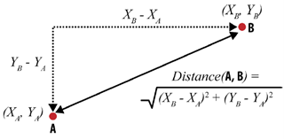
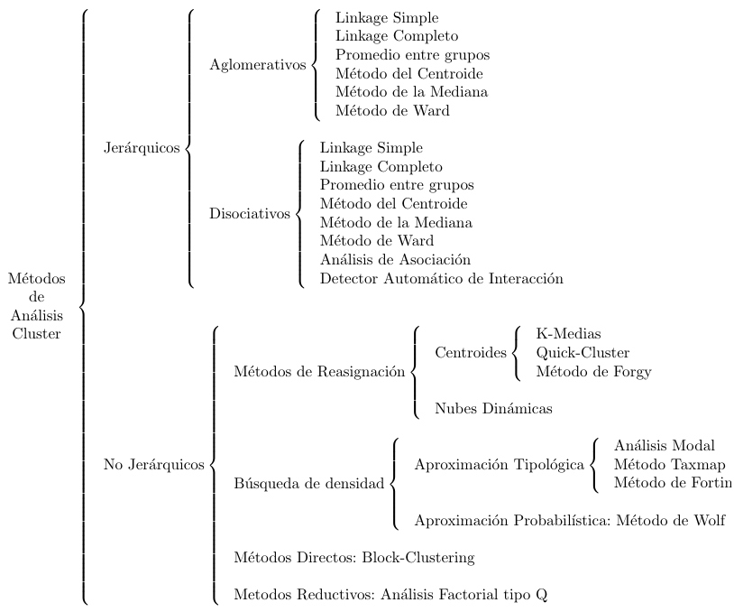
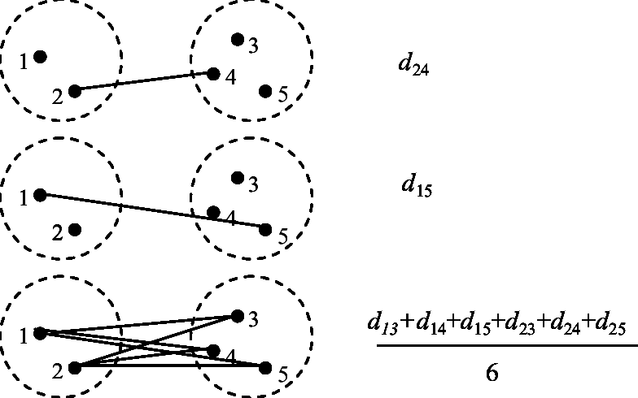

# Introducció
En apartats anteriors hem vist com classificar objectes en funció d'alguna característica d'interès (per exemple, discriminar els clients susceptibles de ser morosos dels que no). Aquest tipus de tasques se denominen de segmentació «supervisada». Es denomina «supervisada» perquè, d'entrada, ja tenim una variable (en aquest cas la «morositat») en funció de la qual volem classificar els objectes. No obstant això, en altres ocasions potser volem trobar grups (per exemple, grups de clients), sense cap característica predefinida. És a dir, poden dividir-se els clients de manera natural en diversos grups? Aquesta idea d'agrupar les dades en categories «no supervisades» es denomina *clustering*.

El punt de partida acostuma a ser una matriu de dades que proporciona valors de les variables per a un conjunt d'individus. Cada fila conté els valors de cada variable per a un individu i cada columna mostra els valors d'una variable al llarg de tots els individus. L'objectiu és agrupar els individus representats en files, si bé també és perfectament possible agrupar variables.

La realització d'una anàlisi de clústers implica la presa de diverses decisions en etapes consecutives: elecció de les variables per a descriure a cada individu; elecció de la mesura d'associació que permeti mesurar la similitud o distància entre els objectes (ja sigui entre dos objectes o entre un objecte i un clúster); i elecció de la tècnica de clúster a emprar. En primer lloc, analitzarem les mesures de similitud i distància i, a continuació, ens centrarem en les tècniques de *clustering*.


## Similitud i distàncies
La següent taula mostra la freqüència amb la qual cinc clients han adquirit quatre productes. A partir d'aquesta informació, podem, per exemple, identificar subjectes de característiques similars, com faríem en el cas de voler trobar persones que se semblin als nostres millors clients per a dirigir-nos a ells. També és possible agrupar productes. Molts venedors, com Amazon o Netflix, utilitzen aquestes tècniques per a oferir recomanacions de productes similars o procedents d'usuaris similars. És el que ocorre quan veiem missatges com “les persones que van comprar A també van comprar B”.

```{r}
data <-read.table ("data/prod.txt", row.names = 1, sep="\t", header=TRUE)
data

```

Ara necessitem algun mètode que permeti mesurar la similitud o la distància entre clients. Com determinar que dues persones (o dos productes) són similars? Una manera de calcular la distància entre dos objectes A i B és la distància euclidiana. La següent Figura mostra dos objectes, A i B, en un pla bidimensional. L'objecte A està en les coordenades ($x_A$, $y_A$) i l'objecte B en les coordenades ($x_B$, $y_B$). Podem traçar un triangle entre els dos objectes, tal com mostra la Figura. Sabem que el quadrat de la hipotenusa (la distància entre A i B) és la suma dels quadrats dels altres dos costats del triangle.

```{r echo=FALSE, out.width='40%', fig.align='center', fig.cap = "Distància euclidiana (Provost y Fawcett, p. 143)"}

```

En síntesi, podem calcular la distància entre dos elements a partir de les distàncies entre les seves dimensions individuals. La distància euclidiana, a més, no té per què limitar-se a dues dimensions, sinó que pot incloure *n* dimensions. L'equació per al càlcul de la distància és la següent:

$$
\sqrt{(d_{1,A} - d_{1,B})^2 + (d_{2,A} - d_{2,B})^2 + \dots + (d_{n,A} - d_{n,B})^2}
$$

Per exemple, la distància entre el client 1 i el client 2 és:

$$
\sqrt{(2 - 1)^2 + (3 - 3)^2 + (4 - 5)^2 + (6 - 4)^2} = 2,45
$$

Seguint la mateixa lògica, podem construir una matriu de distàncies entre tots els clients.

|           | Cliente.1 | Cliente.2 | Cliente.3 | Cliente.4 | Cliente.5 |
|:---------:|:---------:|:---------:|:---------:|:---------:|:---------:|
| Cliente.1 |     0     |           |           |           |           |
| Cliente.2 |   2,45    |     0     |           |           |           |
| Cliente.3 |   4,24    |   5,48    |     0     |           |           |
| Cliente.4 |   9,75    |  10,72    |   6,86    |     0     |           |
| Cliente.5 |   9,00    |   9,85    |   5,74    |   2,00    |     0     |


## Tècniques de clustering
Les tècniques de *clustering*, com a mostra la Figura, són molt nombroses.

```{r echo=FALSE, out.width='60%', fig.align='center', fig.cap = "Tècniques de clustering. Gallardo, J.A. Introducción al análisis clúster, p. 63. https://www.ugr.es/~gallardo/pdf/cluster-g.pdf"}

```

Els mètodes jeràrquics tenen per finalitat agrupar objectes (o clústers) per a formar-ne un de nou, o bé, al revés, dividir algun existent per a donar origen a altres dos. Aquestes dues estratègies es coneixen com a «aglomeració», començant l'anàlisi amb tants grups com individus hi hagi per a agrupar-los progressivament de manera ascendent, i «dissociació», que, al revés, comença amb un conglomerat que engloba tots els casos per a, a través de successives divisions, formar grups cada vegada més petits.

Vegem un exemple d'aplicació de mètode jeràrquic «aglomeratiu». Partim de la matriu de distàncies entre cinc clients. Observem que la distància més curta entre dos clients —és a dir, la major similitud— és l'existent entre els clients 4 i 5 (2,0) que passen a conformar el primer clúster (4,5).

A continuació, hem de reelaborar la matriu de distàncies, calculant la distància entre la resta d'objectes i el clúster (4,5). En aquest punt existeixen diverses opcions: distància mínima (*single linkage*), distància màxima (*complete linkage*) i mitjana entre grups (*average linkage*).


```{r echo=FALSE, out.width='40%', fig.align='center', fig.cap = "Métodos de cálculo de distancia entre objetos y clústers (o entre clústers)"}


```

En el mètode de la distància mínima (*single*) es considera que la distància entre dos clústers ve donada per la distància mínima entre els seus components. Seguint amb l'exemple, la distància entre el client 1 i el clúster (4,5) és de 9,0 perquè aquesta era la distància entre 1 i 5, sent aquest últim l'element del clúster més pròxim a 1, ja que 4 estava a una distància de 9,75.


|       |   1   |   2   |   3   | (4,5) |
|:-----:|:-----:|:-----:|:-----:|:-----:|
|   1   |   0   |       |       |       |
|   2   | 2,45  |   0   |       |       |
|   3   | 4,24  | 5,48  |   0   |       |
| (4,5) | 9,00  | 9,85  | 5,74  |   0   |

En la següent taula s'observa que, ara, la distància mínima és l'existent entre 1 i 2 que passen a formar un nou clúster (1,2). Novament, recalculem la matriu de distàncies emprant el mateix mètode.

|        | (1,2) |   3   | (4,5) |
|:------:|:-----:|:-----:|:-----:|
| (1,2)  |   0   |       |       |
|   3    | 4,24  |   0   |       |
| (4,5)  | 9,00  | 5,74  |   0   |


La major similitud és ara la que s'observa entre el clúster (1,2) i el client 3 que passen a conformar un nou clúster (1,2,3).

|          | (1,2,3) | (4,5) |
|:--------:|:-------:|:-----:|
| (1,2,3)  |    0    |       |
|  (4,5)   |  5,74   |   0   |


Els mètodes jeràrquics permeten la construcció d'un arbre de classificació que rep el nom de dendrograma. Aquest gràfic permet seguir el procediment d'unió, mostrant quins grups es van unint, en quin nivell ho fan, així com el valor de la mesura d'associació entre els grups quan aquests s'agrupen. Ho veurem ara amb alguns exemples en R.

# Clustering amb R

## Productes i clients
Veurem, en primer lloc, com fer amb R l'anàlisi del dataset de clients i productes que acabem d'explicar. El primer pas és calcular les distàncies. Farem servir la distància euclidiana, tot i que hi ha altres opcions.

```{r}
data_dist <- dist(data, method = "euclidean")
data_dist

```

Procedirem ara a crear un dendrograma d'un clúster jeràrquic aglomeratiu amb mètrode d'agrupació *single* (també conegut com *nearest neighbor*).

```{r}
cluster_clients <- hclust(data_dist, method="single")

```

Finalment, visualitzem el dendrograma.

```{r}
plot(cluster_clients, hang = -1)

```

## Delinqüència als Estats Units
Per al segon exemple, carregarem un *dataset* disponible en R amb dades de delinqüència en diferents estats dels Estats Units.

```{r}
data("USArrests")
head(USArrests)

```

En aquest cas farem un dendrograma d'un clúster jeràrquic aglomeratiu, però amb mètode d'agrupació *average*.

```{r}
crim <- hclust(dist(USArrests), "average")
plot(crim, hang=-1)

```


Vegem, per exemple, les dades d'Iowa i New Hampshire

```{r}
USArrests[c(15,29), ]

```

O els d'Illinois i New York.

```{r}
USArrests[c(13,32), ]

```

Podem dividir el dendrograma en 4 clústers.

```{r}
plot(crim, hang=-1)
rect.hclust(crim, k = 4)

```

## Clustering no jeràrquic (*k-means*)
A diferència dels exemples anteriors, en aquest cas farem un clustering no jeràrquic. El clustering *k-means* és una tècnica d'aprenentatge no supervisat que té com a objectiu agrupar un conjunt de dades en *k* grups (o clústers) segons la seva similitud. El mètode funciona assignant inicialment cada punt de dades a un dels *k* clústers, sovint de manera aleatòria, i després ajustant iterativament la pertinença dels punts i les posicions dels centres dels clústers (*centroides*) per minimitzar la variabilitat interna de cada grup.

En primer lloc, carreguem el paquet `cluster` i el dataset `ruspini`, consistent en 75 observacions de dues variables ($x$ i $y$).

```{r}
library(cluster)
data(ruspini)
head(ruspini)

```

Representem les dades gràficament en un diagrama de dispersió.

```{r}
plot(ruspini)

```

Ara fem l'agrupament en 4 clústers (es pot canviar)
```{r}
k <- kmeans(ruspini, centers = 4)

```

I ara els representem. Demanem que tinguin diferents colors. La segona línia de codi, També podem representar els punts centrals (*centroides*).
```{r}
plot(ruspini, col = k$cluster)
points(k$centers, cex=2, col=11, pch=19) 

```


## Clustering no jeràrquic amb les dades de delinqüència
El quart i últim exemple, també utilitza el procediment k-means. El farem sobre les dades de criminalitat a Estats Units que ja hem vist.


```{r}
k2 <- kmeans(scale(USArrests), 4)

```

```{r, warning=FALSE, message=FALSE}
library(factoextra)

factoextra::fviz_cluster(k2, data = USArrests,
             main = "Agrupació d'estats per criminalitat")

```


# Exercicis

## Clustering de clients d'un centre comercial
Un centre comercial ha recopilat les dades de 40 clients. Per a cadascun d'ells té, a més del nom, la seva edat, els seus ingressos (en milers d'euros) i el nombre de visites anuals al centre comercial. A partir d'aquestes dades, crea un dendrograma jeràrquic utilitzant el mètode d'agrupació que prefereixis (*single*, *complete* o *average*). Comenta el resultat. Qui és el client amb un comportament més semblant al de Liam? I el més similar a Maria?

```{r, echo=FALSE}
clients <-read.table ("data/clients.txt", row.names = 1, sep="\t", header=TRUE)
clients

```


## Variacions del clustering de clients
Fent servir el mateix dataset de l'exercici anterior, prova de modificar el mètode d'agrupació (*single*, *complete* o *average*). Compara els dendogrames resultants. Són iguals? Diferents? Selecciona algun dels clústers de clients i comenta les similituds o diferències en funció del mètode d'agrupació emprat.

## Vins amb denominació d'orígen
Tenim les dades d'alcohol, acidesa i intensitat de 18 vins procedents de tres denominacions d'origen. Els vins estan identificats amb una lletra corresponent a la denominació d'origen (P = Priorat, R = Rioja, S = Somontano) i un número correlatiu. Prova d'agrupar els vins en clústers utilitzant diferents mètodes i comprova si en cada cas els vins s'agrupen correctament per denominació d'origen o no.


```{r, echo=FALSE}
vins <- read.table ("data/vins.txt", row.names = 1, sep="\t", header=T)
vins

```


## Agrupament de flors per espècie
Carrega el dataset `iris` que ja hem emprat en diverses ocaions. El dataset conté quatre variables numèriques (Sepal.Length, Sepal.Width, Petal.Length, Petal.Width) de tres espècies de flors (setosa, versicolor i virginica).

De manera opcional, pots estandarditzar les variables numèriques amb la funció `scale` (com hem fet al quart exemple amb les dades de criminalitat). A continuació, aplica k-means amb diferents valors de *k* i observa si les flors s'agrupen o no en funció de les espècies a les quals pertanyen.


